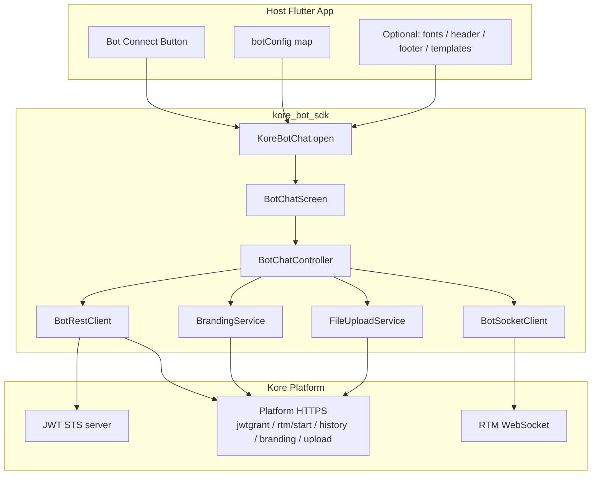

# Kore Bot Flutter SDK — High Level Design (HLD)

**Version:** 1.1.0  
**Last updated:** July 2026  
**Scope:** `Flutter_Code_Bot_SDK/` (`kore_bot_sdk` package + `example` app)  
**Companion:** [LLD.md](./LLD.md)

---

## 1. Purpose

The Kore Bot Flutter SDK is a **pure Flutter** replacement for the native Android/iOS chat UI previously opened through MethodChannel `kore.botsdk/chatbot` in **Flutter Public New**.

Host apps pass the same bot config map as before, call one API, and receive a full classic Kore Bot chat experience: STS/JWT auth, RTM WebSocket messaging, branding, attachments, speech, and rich templates.

This SDK targets the **classic Kore Bot platform** (not the Agents / Artemis runtime). Host-facing injection patterns (header, footer, fonts, templates) follow the same architecture style as the Artemis Flutter UI SDK.

---

## 2. Goals & Non-Goals

### Goals

| Goal | How it is met |
|------|----------------|
| One-line chat launch | `KoreBotChat.open(context, botConfig: …)` |
| Legacy config compatibility | Same MethodChannel keys (`clientId`, `botId`, `jwt_server_url`, …) |
| Pure Flutter UI (no native Activities/VCs) | `BotChatScreen` + Dart networking |
| Classic Kore auth + RTM | STS → jwtgrant → rtm/start → WebSocket |
| Branding | `GET /api/websdkthemes/{botId}/activetheme` → `BotChatTheme` |
| Template parity | Android ViewHolder set ported to Flutter widgets |
| Host chrome injection | `headerBuilder` / `footerBuilder` |
| Custom / override templates | `BotTemplateRegistry` |
| Custom fonts | Host `pubspec.yaml` fonts + `BotChatFonts` |
| Offline awareness | `NoInternetBanner` + `connectivity_plus` |
| Resume after background | `checkConnectionAndRetry()` on `AppLifecycleState.resumed` |

### Non-Goals (current release)

- Agents platform / Artemis socket plugin transport
- Webhook-only channel as primary path (`isWebHook` reserved)
- Full offline message queue / store-and-forward UI
- Built-in analytics dashboard

---

## 3. System Context



---

## 4. Logical Architecture

```
┌─────────────────────────────────────────────────────────────┐
│  Layer 1 — Host Application                                  │
│  • example/lib/main.dart                                     │
│  • botConfig + optional BotChatFonts / builders / registry   │
└──────────────────────────┬──────────────────────────────────┘
                           │ KoreBotChat.open(...)
┌──────────────────────────▼──────────────────────────────────┐
│  Layer 2 — Presentation (UI)                                 │
│  • BotChatScreen (lifecycle, connectivity, compose)          │
│  • Header / footer builders, MessageBubble, templates        │
│  • Theme / fonts / NoInternetBanner                          │
└──────────────────────────┬──────────────────────────────────┘
                           │ streams + commands
┌──────────────────────────▼──────────────────────────────────┐
│  Layer 3 — Orchestration                                     │
│  • BotChatController (connect, send, history, session)       │
│  • BotChatSessionState (minimize / close / history limit)    │
└──────────────────────────┬──────────────────────────────────┘
                           │
┌──────────────────────────▼──────────────────────────────────┐
│  Layer 4 — Networking & Device Services                      │
│  • BotRestClient, BotSocketClient, BrandingService           │
│  • FileUploadService, SpeechToText / TextToSpeech           │
└──────────────────────────┬──────────────────────────────────┘
                           │
┌──────────────────────────▼──────────────────────────────────┐
│  Kore Platform (HTTPS + WSS)                                 │
└─────────────────────────────────────────────────────────────┘
```

---

## 5. Major Components

| Component | Responsibility |
|-----------|----------------|
| `KoreBotChat` | Public entry: push chat route |
| `BotChatScreen` | UI lifecycle, connectivity, resume reconnect, compose |
| `BotChatController` | Auth, socket, messages, history, attachments, events |
| `BotConfig` | Typed config from legacy map keys |
| `BotRestClient` | STS, jwtgrant, rtm/start, history |
| `BotSocketClient` | RTM WebSocket send/receive |
| `BrandingService` | Active theme → `BotChatTheme` |
| `FileUploadService` | Chunked Kore file upload |
| `BotTemplateRegistry` | Host new + override template renderers |
| `BotChatFonts` | Host font family / monospace / TextTheme |
| `NetworkConnectivityMonitor` | Device reachability via `connectivity_plus` |
| `BotChatSessionState` | Minimize vs Close next-open behavior |
| Example app | Integration reference |

---

## 6. Primary Data Flows

### 6.1 Open Chat (happy path)

1. Host calls `KoreBotChat.open(context, botConfig: …)`.
2. SDK builds `BotConfig`, applies optional fonts, pushes `BotChatScreen`.
3. Controller: STS JWT (or supplied token) → jwtgrant → rtm/start → WebSocket.
4. Branding loads; theme/icon update.
5. Optional history (first open / reconnect after minimize).
6. User chats; `onEvent` notifies host of lifecycle/errors.

### 6.2 Send Message

1. User submits from compose footer (or template button).
2. Controller ensures socket (`_ensureConnectedForSend` / reconnect if needed).
3. Outbound frame: `message.body`, `customData` (+ `botToken`), `botInfo`, meta.
4. Inbound bot frames parsed to `ChatMessage` + `TemplatePayload` and rendered.

### 6.3 History / Minimize / Close

| Action | Behavior |
|--------|----------|
| Pull-to-refresh | History API with `offset` = displayed message count |
| Minimize | Persist live-session limit; next open `isReconnect=true` |
| Close | Clear session; next open fresh (`isReconnect=false`, no history) |

### 6.4 Host Injection

1. **Header / footer** — `headerBuilder` / `footerBuilder` replace defaults; builders receive context with actions (`onClose`, `onSend`, …).
2. **Templates** — `BotTemplateRegistry.register(type, builder, override: …)`; looked up before built-in switch in `MessageBubble`.
3. **Fonts** — Host registers TTFs in its `pubspec.yaml`, passes `BotChatFonts(family: '…')`; applied via `ThemeData` + markdown monospace extension.
4. **customData** — Config map merged into jwtgrant/rtm `botInfo` and every outbound `message.customData`.

### 6.5 Offline & Resume

1. Connectivity loss → dark slim `NoInternetBanner` under header; footer disabled.
2. App background / lock often closes RTM socket → state `disconnected` (footer would stay disabled).
3. On `AppLifecycleState.resumed`: refresh connectivity + `checkConnectionAndRetry()` (native SPM `onResume` equivalent).
4. Footer re-enabled when connected and online.

---

## 7. Configuration Model

Config is **map-driven** for MethodChannel parity (`BotConfig.fromMap`).

### Required keys

| Key | Description |
|-----|-------------|
| `clientId` | Bot client id |
| `clientSecret` | Bot client secret |
| `botId` | Stream / task bot id |
| `chatBotName` | Display name |
| `identity` | User identity for STS |
| `jwt_server_url` | STS JWT base URL |
| `server_url` | Platform base URL |

### Common optional keys

| Key | Description |
|-----|-------------|
| `callHistory` | Load history on first open |
| `customData` | Map merged into botInfo / messages |
| `showHeader` / `showAttachment` / `showMicrophone` / `showTextToSpeech` / `showIcon` | UI flags |
| `footerHintText` | Compose placeholder |
| `botIconUrl` / `branding_url` | Icon / branding override |
| `allowBadCertificates` | Dev TLS bypass |
| `jwtToken` / `customJWToken` | Skip STS when provided |

---

## 8. Public Integration Surface

```dart
await KoreBotChat.open(
  context,
  botConfig: { /* legacy keys */ },
  fonts: const BotChatFonts(family: 'BrandSans'),
  headerBuilder: buildCustomChatHeader(),
  footerBuilder: buildCustomChatFooter(),
  templateRegistry: buildCustomTemplateRegistry(),
  onEvent: (code, message) { /* … */ },
);
```

See [LLD.md](./LLD.md) for class-level APIs and file layout.

---

## 9. Comparison: Legacy Native vs Pure Flutter

| Concern | Flutter Public New | This SDK |
|---------|-------------------|----------|
| Chat UI | Native Android/iOS | Flutter widgets |
| Launch | MethodChannel `getChatWindow` | `KoreBotChat.open` |
| Config | Same map keys | Same map keys |
| Callbacks | Native → MethodChannel | `onEvent` |
| Host chrome | Native fragments | Builders / registry |

---

## 10. Risks & Mitigations

| Risk | Mitigation |
|------|------------|
| Socket dies in background | Resume `checkConnectionAndRetry` |
| Stale connectivity after unlock | `NetworkConnectivityMonitor.refresh()` on resume |
| Template type unknown | Registry for custom types; fallback UI for unknowns |
| TLS on simulators | `allowBadCertificates` (dev only) |

---

## 11. Related Documents

- [LLD.md](./LLD.md) — package structure, APIs, sequences
- [README.md](./README.md) — quick start and feature overview
- [kore_bot_sdk/CHANGELOG.md](./kore_bot_sdk/CHANGELOG.md) — release notes
