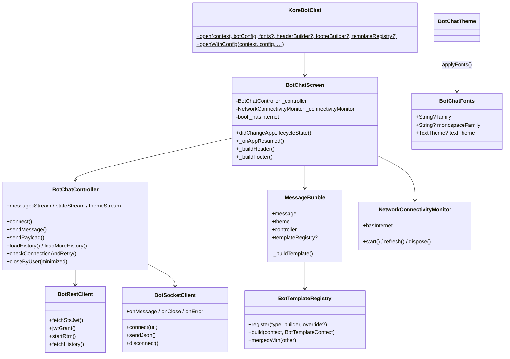

# Kore Bot Flutter SDK — Low Level Design (LLD)

**Version:** 1.1.0  
**Last updated:** July 2026  
**Companion:** [HLD.md](./HLD.md)

---

## 1. Package Structure

### 1.1 Repository layout

```
Flutter_Code_Bot_SDK/
├── kore_bot_sdk/                 # Publishable Flutter package
│   ├── lib/
│   │   ├── kore_bot_sdk.dart     # Public exports
│   │   └── src/
│   │       ├── config/
│   │       ├── controller/
│   │       ├── models/
│   │       ├── net/
│   │       ├── services/
│   │       ├── session/
│   │       └── ui/
│   ├── assets/
│   ├── test/
│   └── pubspec.yaml
├── example/                      # Host demo app
│   ├── lib/
│   │   ├── main.dart
│   │   ├── custom_chat_header.dart
│   │   ├── custom_chat_footer.dart
│   │   └── custom_templates.dart
│   └── assets/fonts/
├── HLD.md
├── LLD.md
└── README.md
```

### 1.2 `kore_bot_sdk/lib/src` detail

```
src/
├── config/
│   └── bot_config.dart                 # BotConfig + fromMap
├── controller/
│   └── bot_chat_controller.dart        # Orchestration
├── models/
│   ├── branding_theme.dart
│   ├── chat_message.dart
│   └── template_payload.dart           # TemplatePayload, BotButton, …
├── net/
│   ├── bot_connection_state.dart
│   ├── bot_rest_client.dart            # STS, jwtgrant, rtm, history
│   ├── bot_socket_client.dart          # WebSocket
│   ├── bot_socket_connect_io.dart / _stub.dart
│   ├── branding_service.dart
│   ├── file_upload_service.dart
│   └── http_client_factory*.dart       # TLS / bad-cert factory
├── services/
│   └── speech_services.dart            # STT + TTS
├── session/
│   └── bot_chat_session_state.dart     # Minimize / Close
└── ui/
    ├── kore_bot_chat.dart              # KoreBotChat.open
    ├── bot_chat_screen.dart            # Full-screen chat
    ├── chat_header_builder.dart
    ├── chat_footer_builder.dart
    ├── network_connectivity_monitor.dart
    ├── theme/
    │   ├── bot_chat_theme.dart
    │   └── bot_chat_fonts.dart
    ├── widgets/
    │   ├── default_chat_header.dart
    │   ├── compose_footer.dart
    │   ├── no_internet_banner.dart
    │   ├── attachment_preview_bar.dart
    │   ├── bot_avatar.dart
    │   ├── close_or_minimize_dialog.dart
    │   └── typing_indicator.dart
    └── templates/
        ├── bot_template_registry.dart
        ├── message_bubble.dart         # Routing + registry lookup
        ├── text_bubble.dart
        ├── button_template.dart
        ├── … (list, carousel, charts, tables, forms, media, …)
        └── template_helpers.dart
```

---

## 2. Public API Surface

Exported from `package:kore_bot_sdk/kore_bot_sdk.dart`:

| Symbol | Kind | Description |
|--------|------|-------------|
| `KoreBotChat` | Class | `open()`, `openWithConfig()` |
| `BotChatScreen` | Widget | Full-screen chat (advanced hosts) |
| `BotChatController` | Class | Connect / send / history / events |
| `BotConfig` | Class | Typed configuration |
| `BotChatTheme` | Class | Colors, flags, fonts |
| `BotChatFonts` | Class | Host font injection |
| `BotChatFontsExtension` | ThemeExtension | Monospace for code blocks |
| `BotChatHeaderBuilder` / `BotChatHeaderContext` | typedef / class | Custom header |
| `BotChatFooterBuilder` / `BotChatFooterContext` | typedef / class | Custom footer |
| `buildDefaultChatHeader` / `buildDefaultChatFooter` | Functions | Reuse defaults |
| `BotTemplateRegistry` / `BotTemplateContext` | Classes | Template injection |
| `BotTemplateTypes` | Constants | Built-in `template_type` keys |
| `BotTemplateBuilder` | typedef | Custom template widget builder |
| `ChatMessage` / `TemplatePayload` / `BotButton` | Models | Message payload models |
| `BotConnectionState` | Enum | idle → connected / reconnecting / … |
| `BotChatSessionState` | Class | Minimize / Close session flags |
| `BrandingTheme` | Class | Parsed branding JSON |
| `TextToSpeechService` / `SpeechToTextService` | Classes | Device speech |

---

## 3. Class Relationships



---

## 4. Key Sequences

### 4.1 Connect

```
Host                KoreBotChat         BotChatScreen       Controller         Rest/Socket
 |                      |                    |                  |                  |
 |-- open(botConfig) -->|                    |                  |                  |
 |                      |-- push screen ---->|                  |                  |
 |                      |                    |-- connect() ---->|                  |
 |                      |                    |                  |-- STS JWT ------>|
 |                      |                    |                  |-- jwtgrant ----->|
 |                      |                    |                  |-- rtm/start ---->|
 |                      |                    |                  |-- WS connect --->|
 |                      |                    |                  |-- branding ----->|
 |                      |                    |<- theme/messages-|                  |
```

### 4.2 Template render (with host registry)

```
Inbound WS frame
    → ChatMessage.fromBotFrame / TemplatePayload.fromJson
    → MessageBubble._buildTemplate
        1. templateRegistry.build(...)   // host override OR new type
        2. else built-in switch (isButton, isCarousel, …)
        3. else generic fallback
```

### 4.3 App resume reconnect

```
AppLifecycleState.resumed
    → NetworkConnectivityMonitor.refresh()
    → if online: BotChatController.checkConnectionAndRetry()
        → if socket already open: ensure state == connected
        → else: rtm/start(isReconnect) + open socket
    → footer enabled when connected && online
```

### 4.4 Outbound message shape (simplified)

```json
{
  "message": {
    "body": "<text or payload>",
    "renderMsg": "<optional display>",
    "customData": { "botToken": "<accessToken>", "...": "host customData" },
    "attachments": []
  },
  "resourceid": "/bot.message",
  "botInfo": {
    "chatBot": "<name>",
    "taskBotId": "<botId>",
    "channelClient": "Flutter",
    "customData": { /* host customData */ }
  },
  "clientMessageId": 0,
  "id": 0,
  "meta": { "timezone": "...", "locale": "eng" },
  "client": "Flutter"
}
```

---

## 5. Host Injection Details

### 5.1 Header / footer

```dart
typedef BotChatHeaderBuilder = Widget Function(
  BuildContext context,
  BotChatHeaderContext header,
);

typedef BotChatFooterBuilder = Widget Function(
  BuildContext context,
  BotChatFooterContext footer,
);
```

`BotChatHeaderContext`: `title`, `theme`, `botIconUrl`, `onClose`  
`BotChatFooterContext`: `controller`, `enabled`, `hintText`, `theme`, attach/mic/tts flags + callbacks

Defaults: `buildDefaultChatHeader` / `buildDefaultChatFooter`.

### 5.2 Template registry

```dart
final registry = BotTemplateRegistry();

// Override existing SDK type
registry.register(
  BotTemplateTypes.button,
  (context, ctx) => CustomButtonTemplate(templateContext: ctx),
  override: true,
);

// New type not in SDK
registry.register(
  'promo_card',
  (context, ctx) => CustomPromoCardTemplate(templateContext: ctx),
);
```

Lookup types are normalized to lowercase to match `TemplatePayload.templateType`.

### 5.3 Fonts

1. Host `pubspec.yaml`:

```yaml
flutter:
  fonts:
    - family: 29LTBukra
      fonts:
        - asset: assets/fonts/29LTBukra-Regular.ttf
        - asset: assets/fonts/29LTBukra-Bold.ttf
          weight: 700
```

2. Inject:

```dart
fonts: const BotChatFonts(family: '29LTBukra'),
```

3. `BotChatTheme.applyFonts` → `toThemeData(fontFamily: …)` + `BotChatFontsExtension` for markdown code.

---

## 6. Connection & Session State

### 6.1 `BotConnectionState`

`idle` → `connecting` → `connected` ↔ `reconnecting` → `disconnected` / `error`

Footer `enabled` requires: `state.isConnected && hasInternet && !uploading`.

### 6.2 `BotChatSessionState`

| User action | Next open | History |
|-------------|-----------|---------|
| Minimize | `afterMinimize` → `isReconnect=true` | Live-session limit restored |
| Close | `afterClose` → fresh session | Not loaded |
| First open | `fresh` | If `callHistory` |

---

## 7. Networking Endpoints (classic bot)

| Step | Method | Purpose |
|------|--------|---------|
| STS | `POST {jwt_server_url}users/sts` | Issue JWT |
| Grant | `POST {server}/api/oAuth/token/jwtgrant` | Access token + user id |
| RTM | `POST {server}/api/rtm/start` | WebSocket URL (`isReconnect` query/body per SPM) |
| History | `GET` history with `offset` / `limit` | Pagination |
| Branding | `GET /api/websdkthemes/{botId}/activetheme` | Theme JSON |
| Upload | Kore file token + chunk upload | Attachments |

Exact paths/payloads live in `BotRestClient` / `FileUploadService` (parity with Flutter Public New Android).

---

## 8. UI Composition (`BotChatScreen`)

```
Column
├── Header (builder or DefaultChatHeader)   // title centered
├── NoInternetBanner                        // visible when offline
├── LinearProgressIndicator                 // connecting / reconnecting / uploading
├── Optional error MaterialBanner
├── Expanded(ListView messages + MessageBubble)
├── QuickReplyBar
├── AttachmentPreviewBar (optional)
└── Footer (builder or ComposeFooter)
```

Lifecycle: `WidgetsBindingObserver` → on `resumed` refresh connectivity + `checkConnectionAndRetry()`.

---

## 9. Example App Reference

| File | Role |
|------|------|
| `example/lib/main.dart` | `botConfig` + `KoreBotChat.open` |
| `example/lib/custom_chat_header.dart` | Sample header injection |
| `example/lib/custom_chat_footer.dart` | Sample footer injection |
| `example/lib/custom_templates.dart` | Override `button` + new `promo_card` |
| `example/assets/fonts/` | Sample `29LTBukra` family |

Uncomment the corresponding lines in `main.dart` to enable each injection.

---

## 10. Testing Notes

- Unit: `kore_bot_sdk/test/` — payload parsing / template type recognition.
- Manual: connect, templates, pull history, minimize/close, airplane mode banner, background → lock → resume footer.
- Fonts require **full restart** after `pubspec.yaml` font registration (hot reload is insufficient).

---

## 11. Related Documents

- [HLD.md](./HLD.md) — system context and flows
- [README.md](./README.md) — quick start
